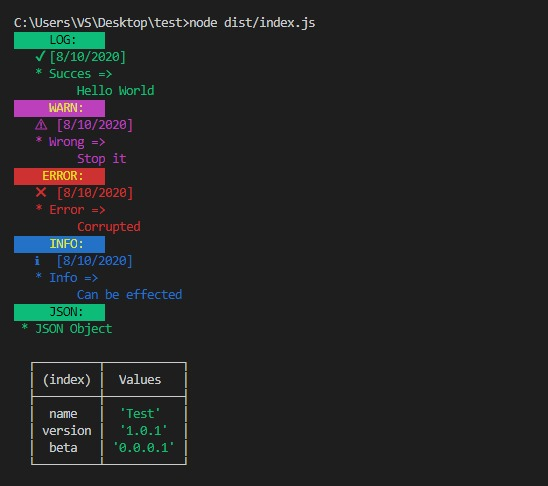

# RESTful API Debugger for node.js console and Angular 7/8/9/10

VS-Debugger is the next level console log writer that can be enabled on the development version and deactivated simultaneously on the product version.This module supports browser level consoles and command line level consoles.
Added support of Angular ivy engine compatibility. 😎



## Installation

```
npm i vs-debugger
```

## Usage

### Typescript

- First you need to use environment.ts file. If not create new file called debugger.ts

```
import { VSDebugger } from 'vs-debugger';

class Environment {

    _debugger = VSDebugger.getDebugger();

    constructor(enable: boolean = false){
        this._debugger.enable(enable);
    }

    getDebugger(): VSDebugger {
        return this._debugger;
    }

}

export default new Environment(true);

```

- Then import this environment.ts or debugger.ts file into whatever you want to print colored console logs

```
import _console from './path_to_environment.ts';
import { CONSOLE_TYPES } 'vs-debugger/dist/types/types'

...


_console._debugger.print(CONSOLE_TYPES.LOG,'Printing name','VS-Debugger');

```

- There are 4 types of console logs.
  1. CONSOLE_TYPES.LOG
  2. CONSOLE_TYPES.ERROR
  3. CONSOLE_TYPES.WARN
  4. CONSOLE_TYPES.INFO

* To print a json object then you can use following method and you can see a table in terminal.

```

const obj = {
    name: 'John Doe',
    age: '23'
};

_console._debugger.print_obj('Printing json object', obj);
```

Thats all! 😎😎

Feel free to contact me via <a href="mailto:vish.drck@gmail.com">vish.drck@gmail.com</a> if you have any problems.
